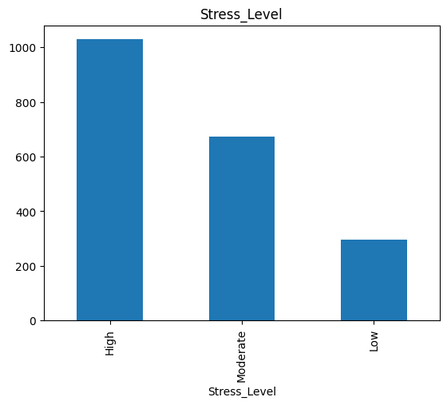
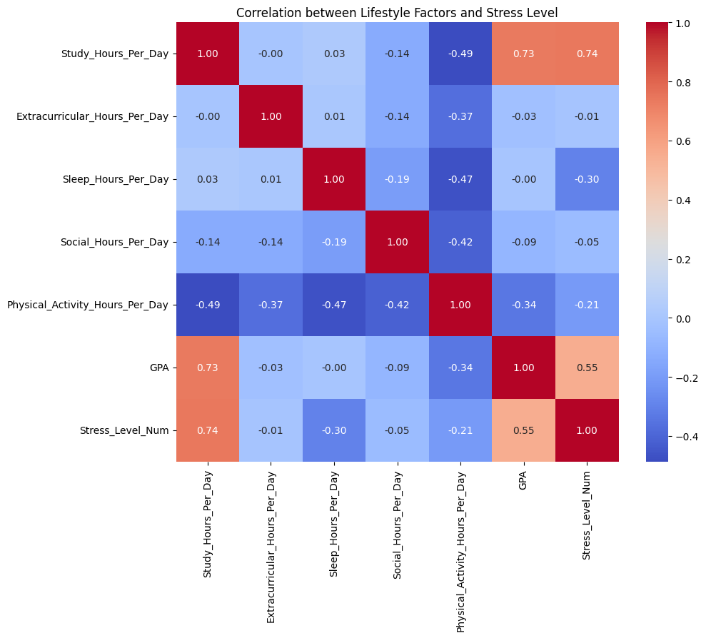
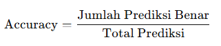
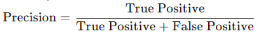
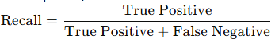
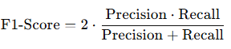
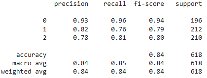
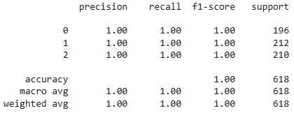

# Laporan Proyek Machine Learning - Sayyid Faruk Romdoni

## Domain Proyek

Stres merupakan salah satu tantangan utama yang dihadapi oleh pelajar di seluruh dunia. Tekanan akademik, tuntutan sosial, manajemen waktu, dan faktor gaya hidup seperti pola makan, aktivitas fisik, serta waktu tidur, sering kali menjadi pemicu utama stres. Jika tidak dikelola dengan baik, stres dapat berdampak negatif pada kesehatan mental dan fisik pelajar, yang pada akhirnya memengaruhi kinerja akademik mereka.

Seiring dengan perkembangan teknologi, machine learning telah menjadi salah satu pendekatan yang efektif untuk memahami dan menganalisis faktor-faktor kompleks dalam kehidupan manusia, termasuk stres. Dengan memanfaatkan dataset seperti Student Lifestyle Dataset, kita dapat mengeksplorasi hubungan antara gaya hidup pelajar dan tingkat stres mereka, serta membangun model prediksi yang dapat membantu mengklasifikasikan tingkat stres menjadi tiga kategori utama: rendah, sedang, dan tinggi.

## Business Understanding

### Problem Statements

- Faktor gaya hidup apa saja yang paling berpengaruh terhadap tingkat stres mahasiswa?
- Bagaimana tingkat stres mahasiswa dapat diprediksi secara akurat berdasarkan data gaya hidup mereka?

### Goals

- Mengetahui faktor gaya hidup yang paling berpengaruh terhadap tingkat stres mahasiswa.
- Membangun model machine learning yang dapat mengklasifikasikan tingkat stres mahasiswa menjadi tiga kategori (rendah, sedang, tinggi) secara akurat berdasarkan fitur gaya hidup yang tersedia.

### Solution statements
- Melakukan analisis eksplorasi data (EDA) untuk memahami distribusi data, korelasi antar variabel, dan pola data.
- Eksperimen dengan beberapa algoritma klasifikasi, diantaranya Logistic Regression, Random Forest dan XGBoost. Memilih model terbaik berdasarkan skor evaluasi, interpretabilitas, efisiensi, dan kebutuhan proyek.

## Data Understanding
Dataset yang digunakan dalam proyek ini adalah Student Lifestyle Dataset, yang dapat diakses melalui Kaggle di tautan berikut: [Student Lifestyle Dataset](https://www.kaggle.com/datasets/steve1215rogg/student-lifestyle-dataset). Dataset ini berisi data dari 2.000 data pelajar yang dikumpulkan melalui survei Google Form. Data ini mencakup informasi tentang jam belajar, kegiatan ekstrakurikuler, tidur, bersosialisasi, aktivitas fisik, tingkat stres, dan IPK. Data tersebut mencakup tahun akademik dari Agustus 2023 hingga Mei 2024 dan mencerminkan gaya hidup pelajar terutama dari India.

### Variabel-variabel pada Student Lifestyle Dataset adalah sebagai berikut:
- Student_ID :ID unik untuk setiap siswa dalam dataset.
- Study_Hours_Per_Day :Jumlah rata-rata waktu yang dihabiskan siswa untuk belajar setiap hari (dalam jam).
- Extracurricular_Hours_Per_Day : Jumlah rata-rata waktu yang dihabiskan siswa untuk kegiatan ekstrakurikuler setiap hari (dalam jam).
- Sleep_Hours_Per_Day : Jumlah rata-rata waktu yang dihabiskan siswa untuk tidur setiap hari (dalam jam).
- Social_Hours_Per_Day : Jumlah rata-rata waktu yang dihabiskan siswa untuk interaksi sosial setiap hari (dalam jam).
- Physical_Activity_Hours_Per_Day : Jumlah rata-rata waktu yang dihabiskan siswa untuk aktivitas fisik setiap hari (dalam jam).
- GPA : Nilai rata-rata prestasi akademik siswa (Grade Point Average), diukur pada skala GPA Umum (4.0 Scale)
- Stress_Level : Kategori tingkat stres siswa, seperti Low, Moderate, High

**Exploratory Data Analysis**:
- Univariate analysis: untuk melihat distribusi data fitur target.

  

  Dari sini bisa dilihat bahwa dataset ini imbalance.
- Multivariate analysis: untuk melihat hubungan antar setiap variable.
  
  

  Dari analisis korelasi ini, kita dapat menyimpulkan bahwa waktu belajar per hari (Study_Hours_Per_Day) adalah faktor gaya hidup yang paling berpengaruh terhadap tingkat stres mahasiswa, diikuti oleh prestasi akademik (GPA). Selain itu, tidur juga memiliki dampak yang moderat terhadap tingkat stres.

## Data Preparation
Dalam tahap ini, dilakukan langkah-langkah berikut untuk mempersiapkan data agar dapat digunakan dalam model machine learning:

1. **Encoding**: Untuk mengubah label target Stress Level dari bentuk kategori menjadi numerik, digunakan metode mapping. Nilai numerik ini kemudian digunakan sebagai label target dalam model machine learning.

2. **Menangani Imbalanced Data**: Dataset label target memiliki tiga kelas: Low, Moderate, dan High, yang mungkin memiliki distribusi yang tidak merata. Ketidakseimbangan ini dapat menyebabkan model lebih cenderung memprediksi kelas mayoritas. Untuk mengatasi masalah ini, digunakan teknik **Synthetic Minority Oversampling Technique (SMOTE)**, yang secara sintetis menghasilkan data pada kelas minoritas untuk mencapai distribusi yang lebih seimbang.

3. **Split Data**: Dataset dibagi menjadi dua bagian: training set (80%) dan test set (20%). Training set digunakan untuk melatih model, sedangkan test set digunakan untuk mengevaluasi performa model pada data baru.

## Modeling
Ada tiga algoritma machine learning digunakan dalam proses pemodelan ini:
1. **Logistic Regression**:
   - **Parameter**: 
     - `random_state=42`: Digunakan untuk memastikan hasil eksperimen yang konsisten dengan menetapkan nilai seed.
     - `max_iter=1000`: Menentukan jumlah maksimum iterasi algoritma pengoptimalan.
   - **Kelebihan**:
     - Mudah diimplementasikan dan diinterpretasikan.
     - Cepat dalam proses pelatihan.
     - Cocok untuk dataset linear atau mendekati linear.
   - **Kekurangan**:
     - Performa kurang baik pada dataset yang kompleks dan tidak linear.
     - Membutuhkan fitur yang berskala atau distandarkan untuk hasil optimal.
   - **Hasil Evaluasi**:
     - Accuracy: 84.3%
     - ROC-AUC Score: 0.957
     - Performanya baik untuk kelas mayoritas (kelas 0) tetapi lebih rendah untuk kelas minoritas (kelas 1 dan 2).

2. **Random Forest**:
   - **Parameter**: 
     - `random_state=42`: Digunakan untuk memastikan hasil eksperimen yang konsisten dengan menetapkan nilai seed.
   - **Kelebihan**:
     - Dapat menangani data dengan kompleksitas tinggi dan fitur non-linear.
     - Resisten terhadap overfitting jika parameter seperti kedalaman pohon diatur dengan baik.
     - Memberikan fitur penting (feature importance).
   - **Kekurangan**:
     - Lebih lambat dibanding Logistic Regression, terutama pada dataset besar.
     - Rentan terhadap overfitting jika parameter tidak dioptimalkan.
   - **Hasil Evaluasi**:
     - Accuracy: 100%
     - ROC-AUC Score: 1.0
     - Model memprediksi seluruh data dengan sempurna. Namun, performa sempurna ini menimbulkan potensi **overfitting** karena mungkin model hanya "mengingat" data uji.

3. **XGBoost**:
   - **Parameter**: 
     - `random_state=42`: Digunakan untuk memastikan hasil eksperimen yang konsisten dengan menetapkan nilai seed.
   - **Kelebihan**:
     - Memiliki kemampuan generalisasi lebih baik dibanding Random Forest.
     - Sangat efisien pada dataset besar dengan pengaturan hyperparameter yang optimal.
     - Menangani data imbalance dengan baik melalui pengaturan parameter bobot kelas.
   - **Kekurangan**:
     - Membutuhkan waktu pelatihan lebih lama dibanding Logistic Regression.
     - Parameter yang lebih kompleks membutuhkan tuning yang cermat.
   - **Hasil Evaluasi**:
     - Accuracy: 100%
     - ROC-AUC Score: 1.0
     - Sama seperti Random Forest, model memprediksi data secara sempurna dan memiliki risiko **overfitting**.

Berdasarkan evaluasi, **Logistic Regression** dipilih sebagai model terbaik dengan alasan berikut:
1. **Kinerja yang Stabil**: Logistic Regression menunjukkan kinerja realistis dengan accuracy 84.3% dan ROC-AUC 0.957. Ini menandakan model mampu membedakan kelas dengan baik tanpa tanda-tanda overfitting.
2. **Generalitas**: Logistic Regression memberikan performa yang konsisten tanpa "mengingat" data uji seperti yang terjadi pada Random Forest dan XGBoost.
   
## Evaluation
Dalam proyek ini, saya menggunakan **metrik evaluasi klasifikasi** untuk menilai performa model dalam memprediksi data. Berikut adalah metrik-metrik evaluasi yang digunakan beserta hasilnya:

---

#### **Metrik Evaluasi**
1. **Accuracy**:
   - Mengukur proporsi prediksi yang benar dari total prediksi yang dibuat.
   - Formula:  
     
   - Kelebihan: Mudah diinterpretasikan.  
   - Kekurangan: Tidak cocok untuk dataset dengan distribusi kelas yang tidak seimbang.

2. **Precision**:
   - Mengukur proporsi prediksi positif yang benar dari total prediksi positif.  
   - Formula (untuk setiap kelas):  
     
   - Relevan untuk menghindari terlalu banyak kesalahan positif.

3. **Recall**:
   - Mengukur kemampuan model mendeteksi semua instance positif.  
   - Formula (untuk setiap kelas):  
     
   - Relevan ketika penting untuk mendeteksi semua instance suatu kelas (misalnya deteksi penyakit).

4. **F1-Score**:
   - Merupakan rata-rata harmonis antara precision dan recall, memberikan keseimbangan antara keduanya.  
   - Formula:  
     
   - Berguna untuk data dengan distribusi kelas yang tidak seimbang.

5. **ROC-AUC Score**:
   - Mengukur kemampuan model dalam membedakan antara kelas positif dan negatif melalui kurva ROC (Receiver Operating Characteristic).  
   - Nilai AUC mendekati 1 menunjukkan kemampuan klasifikasi yang sangat baik.

---

#### **Hasil Evaluasi**
1. **Logistic Regression**:
   - **Accuracy**: 84.3%  
   - **ROC-AUC Score**: 0.957  
   - Berdasarkan precision, recall, dan F1-score:
   
     - Kelas 0 memiliki performa sangat baik dengan precision 0.93 dan recall 0.96, menunjukkan model mampu memprediksi kelas ini secara akurat.
     - Kelas 1 dan 2 memiliki precision dan recall lebih rendah (rata-rata di atas 0.75), menandakan model memiliki sedikit kesulitan membedakan kedua kelas ini.
   - **Kesimpulan**: Logistic Regression memberikan hasil yang realistis dan menunjukkan generalisasi yang baik untuk semua kelas.

2. **Random Forest** dan **XGBoost**:
   - **Accuracy**: 100%  
   - **ROC-AUC Score**: 1.0  
   - Berdasarkan precision, recall, dan F1-score:
   
     - Kedua model memprediksi semua kelas dengan sempurna (nilai precision, recall, dan F1-score semuanya 1.0). Namun, performa sempurna ini menimbulkan potensi **overfitting**, terutama karena hasil ini berasal dari data uji.

---